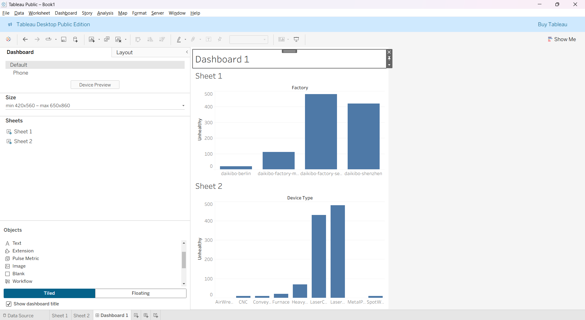

# 🧠 Deloitte Data Analytics Virtual Internship — Daikibo Telemetry Analysis

## 📖 Overview
This project was completed as part of the **Deloitte Data Analytics Virtual Internship** on Forage.  
It focuses on analyzing **telemetry data** from Daikibo’s four global factories to identify which locations and machines experienced the most operational downtime.

---

## 🎯 Objective
To determine:
1. Which **Daikibo factory** experienced the most machine breakdowns  
2. Which **machine types** were most prone to failure in that factory  

---

## 🧩 Dataset
**File:** `daikibo-telemetry-data.json`  
Telemetry messages collected from 4 Daikibo factories:
- Meiyo (Tokyo, Japan)  
- Seiko (Osaka, Japan)  
- Berlin (Germany)  
- Shenzhen (China)  

Each factory has **9 machine types** sending logs every 10 minutes during **May 2021**.

---

## ⚙️ Tools Used
- **Tableau Public** – visualization and dashboard creation  
- **JSON data** – structured IoT/telemetry data  
- **Calculated Fields** – downtime analysis  

---

## 📊 Steps Performed
1. Imported the telemetry JSON dataset into Tableau  
2. Created a calculated field named **`Unhealthy`**, assigning a value of **10** for each “Unhealthy” machine status (10 minutes of downtime)  
3. Built two charts:
   - *Down Time per Factory*  
   - *Down Time per Device Type*  
4. Combined both charts into a dashboard with interactive filtering  
5. Identified the factory with the highest downtime and captured a dashboard screenshot  

---

## 🧾 Key Insights
- The visualization clearly highlights the factory with the **most total downtime**  
- Interactive filters reveal which **machine types** caused the majority of issues  

---

## 🧠 Skills Gained
- Tableau dashboard design  
- JSON data interpretation  
- Calculated field logic  
- Real-world data analytics workflow  

---

## 📎 Output
**Dashboard Screenshot:**  

**Project File:** 
[Download Tableau Project (.twb)](Book1.twb)

---

## 🏆 Certificate
 Deloitte Forage internship, certificate here as [View Deloitte Forage Certificate (.pdf)](deloitte-cert.pdf)
  

---

## 📂 Repository Info
Repo Name:** `daikibo-data-analysis`  

This repository includes:
- `README.md`  
- `Daikibo_Telemetry_Analysis.twb`  
- `Dashboard.png`  
- `Certificate.pdf`

---

